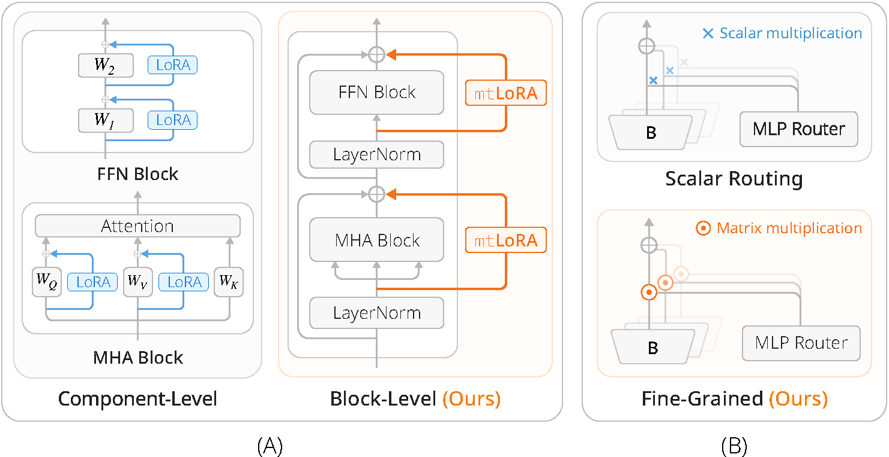
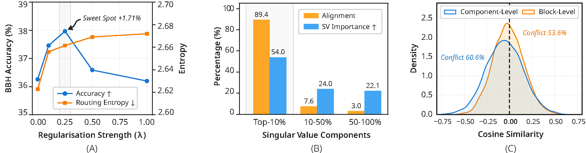
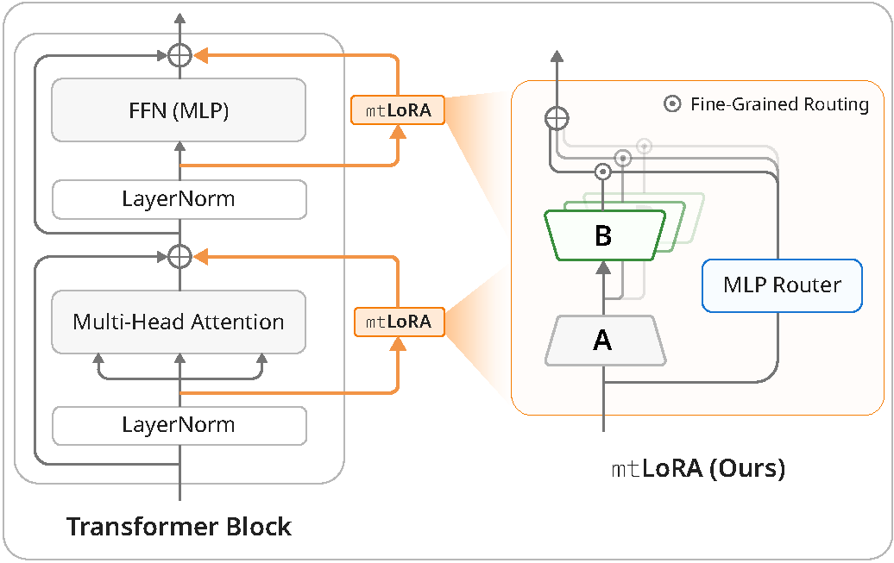

<div align="center">

<h2>mtLoRA: Scalable Multi-Task Low-Rank Model Adaptation</h2>

<h4>🌟 ICLR 2026 🌟</h4>

**Zichen Tian**, **Antoine Ledent**, **Qianru Sun**

*Singapore Management University*

<p>
  
  &emsp;&emsp;
  
</p>

<p>
  <a href="https://openreview.net/forum?id=L3RSb9yTlL">
    
  </a>
  <a href="https://arxiv.org/abs/2603.01526">
    
  </a>
  
  <a href="#-ai-agent-reproduction">
    
  </a>
</p>

</div>

Official implementation of **mtLoRA** (**m**ulti-**t**ask **LoRA**) from the paper **"Scalable Multi-Task Low-Rank Model Adaptation"** (ICLR 2026). Scaling multi-task LoRA to many tasks (15–25+) causes catastrophic performance collapse (e.g., 88.2% → 2.0% accuracy). We identify two root causes — *uniform regularization disrupts shared knowledge* and *component-level adaptation amplifies gradient conflicts* — and propose three novel designs:

1. **Spectral-Aware Regularization** — Selectively orthogonalizes low-SV noise while preserving high-SV shared knowledge
2. **Fine-Grained Routing** — Dimension-specific routing weights instead of scalar weights per LoRA expert
3. **Block-Level Adaptation** — Applies LoRA as a parallel path at the block level, bypassing conflict-amplifying non-linearities

<div align="center">
  
  <br>
  <em><b>(A)</b> Block-Level Adaptation bypasses internal non-linearities to mitigate gradient conflict. <br><b>(B)</b> Fine-Grained Routing assigns dimension-specific weights for superior expressive power.</em>
</div>

---

## 🤖 AI Agent Reproduction

> **One-click experiment reproduction powered by [Claude Code](https://docs.anthropic.com/en/docs/agents-and-tools/claude-code/overview).**
> Open this project in [Cursor](https://www.cursor.com/) or the Claude Code CLI — the agent reads [`CLAUDE.md`](CLAUDE.md) and handles environment setup, data download, and experiment execution automatically.

```
💬 "Help me reproduce Table 2 on my 2× L40 setup"
💬 "Set up the environment for my RTX 4090"
💬 "Run the BBH evaluation with spectral regularization λ=0.5"
```

---

## ✨ Highlights

**+2.3% over SOTA** across four large-scale benchmarks (15–27 tasks each) while using **47% fewer parameters** and **24% less training time**.

NLP results on LLaMA-2-7B (reproduced by this codebase):

| Method            | Dolly-15k → MMLU | Flan-v2 → BBH |      Params       |
| :---------------- | :--------------: | :-----------: | :---------------: |
| LoRAHub           |       42.0       |     34.9      |   75.5M (1.11%)   |
| MMoELoRA          |       42.1       |     35.4      |   75.5M (1.11%)   |
| HydraLoRA         |       42.4       |     36.9      |   75.5M (1.11%)   |
| **mtLoRA (Ours)** |     **44.5**     |   **38.5**    | **39.8M (0.59%)** |

Each design contributes meaningfully — block-level adaptation alone provides **+2.1%** with 50% fewer parameters:

| Block-Level | Spectral Reg. | Fine-Grained Routing |    Params     | Dolly-15k |   BBH    |
| :---------: | :-----------: | :------------------: | :-----------: | :-------: | :------: |
|             |               |                      | 75.5M (1.11%) |   41.6    |   35.5   |
|      ✓      |               |                      | 37.7M (0.56%) |   43.7    |   37.9   |
|      ✓      |       ✓       |                      | 37.7M (0.56%) |   43.6    |   38.4   |
|      ✓      |               |          ✓           | 39.8M (0.59%) |   44.1    |   38.2   |
|      ✓      |       ✓       |          ✓           | 39.8M (0.59%) | **44.5**  | **38.5** |

> 📌 mtLoRA also achieves consistent gains on vision benchmarks (91.7% on DOTA, 81.5% on iNat2018). Full cross-domain results in Table 5 of the paper. Vision code will be released separately.

---

## 🚀 Getting Started

### Requirements

- Python 3.10+ &ensp;|&ensp; PyTorch 2.1+ &ensp;|&ensp; CUDA 11.8+
- 1–2 GPUs with ≥16 GB VRAM (for LLaMA-2-7B with DDP)

### Installation

```bash
# Create environment
conda env create -f environment.yml
conda activate mtlora

# Install our custom PEFT library
pip install -e ./peft
```

<details>
<summary><b>Blackwell GPUs (CUDA 12.4+)</b></summary>

```bash
conda env create -f environment_cu124.yml
conda activate mtlora
pip install torch==2.5.1 --index-url https://download.pytorch.org/whl/cu124
pip install -e ./peft
```
</details>

### Data Preparation

**Base Model** — Symlink LLaMA-2-7B (required for all experiments):
```bash
ln -s /path/to/llama-2-7b ./data/llama-2-7b
ln -s /path/to/llama-2-13b ./data/llama-2-13b   # Only needed for Table S7
```

**Training Data** — Download from Hugging Face:

| Setup | Training Data                  | Evaluation                | HF Source                                                                                            |
| :---- | :----------------------------- | :------------------------ | :--------------------------------------------------------------------------------------------------- |
| BBH   | Flan-v2 subset (30k examples)  | BBH 3-shot (27 tasks)     | [`Muennighoff/flan`](https://huggingface.co/datasets/Muennighoff/flan)                               |
| MMLU  | Dolly-15K (instruction tuning) | MMLU 5-shot (57 subjects) | [`databricks/databricks-dolly-15k`](https://huggingface.co/datasets/databricks/databricks-dolly-15k) |

Evaluation datasets (`data/bbh/` and `data/mmlu_dataset/`) are already included.

---

## 🔧 Reproduce Paper Results

### Main Tables

| Script                                 | Paper Reference | Description                     |
| :------------------------------------- | :-------------- | :------------------------------ |
| `bash tables/0_main_ablation.sh`       | Table 2         | Contribution of each key design |
| `bash tables/1_routing_granularity.sh` | Table 3         | Routing granularity ablation    |
| `bash tables/2_block_level.sh`         | Table 4         | Block-level adaptation ablation |
| `bash tables/3_llama13b.sh`            | Table S7        | LLaMA-2-13B scalability         |

Each script runs both BBH and MMLU experiments end-to-end (training + evaluation).

### Custom Experiments

<details>
<summary><b>BBH Setup</b> — Train on Flan-v2, evaluate on BBH (3-shot)</summary>

```bash
# Train
python train.py \
    --method mtlora \
    --model_name_or_path ./data/llama-2-7b \
    --dataset_dir ./data/flan_v2_subset \
    --output_dir ./output/custom_bbh \
    --lora_rank 16 --lora_nums 16 --enable_blc \
    --enable_block_adapter --block_adapter_type ffn \
    --enable_spectral_reg --spectral_reg_lambda 1.0 \
    --enable_fine_grained_routing --routing_group_size 2048 \
    --bf16 --num_train_epochs 1

# Evaluate
python eval_bbh.py \
    --model_name_or_path ./data/llama-2-7b \
    --lora_checkpoint ./output/custom_bbh/sft_lora_model \
    --output_dir ./output/custom_bbh/bbh_eval \
    --num_few_shot 3
```
</details>

<details>
<summary><b>MMLU Setup</b> — Train on Dolly-15K, evaluate on MMLU (5-shot)</summary>

```bash
# Train
python train.py \
    --method mtlora \
    --model_name_or_path ./data/llama-2-7b \
    --dataset_dir ./data/dolly-15k-converted \
    --output_dir ./output/custom_mmlu \
    --lora_rank 16 --lora_nums 16 --enable_blc \
    --enable_block_adapter --block_adapter_type ffn \
    --enable_spectral_reg --spectral_reg_lambda 0.5 \
    --enable_fine_grained_routing --routing_group_size 2048 \
    --bf16 --num_train_epochs 1

# Evaluate
python eval_mmlu.py \
    --model_name_or_path ./data/llama-2-7b \
    --lora_checkpoint ./output/custom_mmlu/sft_lora_model \
    --output_dir ./output/custom_mmlu/mmlu_5shot \
    --num_few_shot 5 \
    --mmlu_data_dir ./data/mmlu_dataset
```
</details>

### Analysis Figures

Scripts for reproducing paper figures are in `tables/analysis/`:

| Script                          | Paper Figure | Content                          |
| :------------------------------ | :----------- | :------------------------------- |
| `fig1a_routing_entropy.ipynb`   | Figure 1(A)  | Regularization–routing trade-off |
| `fig1b_spectral_conflict.ipynb` | Figure 1(B)  | Spectral conflict analysis       |
| `figS2_sv_spectrum.py`          | Figure S2    | SV spectrum visualization        |
| `figS3_gradient_perlayer.py`    | Figure S3    | Per-layer gradient correlation   |
| `figS4_routing_pattern.py`      | Figure S4    | Routing weight patterns          |

---

## 💡 Method Overview

Multi-task LoRA suffers from a fundamental **regularization–routing trade-off**: strengthening regularization to reduce inter-task conflict inadvertently suppresses routing effectiveness. We trace this to two root causes and propose targeted solutions:

<div align="center">
  
  <br>
  <em><b>(A)</b> Regularization-routing trade-off. <b>(B)</b> Shared knowledge concentrates in high-SV components. <b>(C)</b> Block-level adaptation reduces gradient conflict by 76%.</em>
</div>
<br>

| Design                       | Root Cause Addressed                              | Key Idea                                                                        |
| :--------------------------- | :------------------------------------------------ | :------------------------------------------------------------------------------ |
| 🎯 **Spectral-Aware Reg.**    | Uniform regularization disrupts shared knowledge  | Weight by `w(σ)=exp(−σ/σ̄)`: orthogonalize low-SV noise, preserve high-SV signal |
| 🔀 **Fine-Grained Routing**   | Scalar routing ignores dimension heterogeneity    | Router MLP outputs per-dimension weights `Πᵢ ∈ ℝᵍ` instead of scalars `πᵢ ∈ ℝ`  |
| 🧱 **Block-Level Adaptation** | Component-level LoRA amplifies gradient conflicts | Parallel adapter path bypasses Softmax: `x' = x + F(LN(x)) + Δ(LN(x))`          |

<div align="center">
  
  <br>
  <em>Overall architecture of mtLoRA. The mtLoRA module (right) is attached as a parallel path after each LayerNorm. A router MLP generates dimension-specific weights to dynamically compose task experts.</em>
</div>

---

## ⚙️ Configuration Reference

<details>
<summary><b>Method Selection</b></summary>

```bash
--method lora          # Standard single LoRA
--method hydralora     # HydraLoRA baseline (multi-expert, no mtLoRA extensions)
--method mtlora        # Full mtLoRA (block adapter + spectral reg + FGR)
```
</details>

<details>
<summary><b>mtLoRA Components</b></summary>

```bash
# Block-Level Adaptation
--enable_block_adapter              # Enable block-level instead of component-level
--block_adapter_type ffn            # Options: attention, ffn, both
--block_adapter_style lowrank

# Spectral-Aware Regularization
--enable_spectral_reg               # Enable spectral regularization
--spectral_reg_lambda 1.0           # Regularization strength
--spectral_reg_frequency 1          # SVD frequency (per epoch)

# Fine-Grained Routing
--enable_fine_grained_routing
--routing_group_size 2048           # Smaller = finer granularity (g = d/group_size)
```
</details>

<details>
<summary><b>Common Hyperparameters</b></summary>

```bash
--lora_rank 16                      # LoRA rank
--lora_alpha 64                     # LoRA alpha scaling
--learning_rate 0.0002
--per_device_train_batch_size 16
--num_train_epochs 1
--max_seq_length 512
```
</details>

<details>
<summary><b>Hardware Requirements</b></summary>

| Experiment            | GPU Memory  | Recommended  |
| :-------------------- | :---------- | :----------- |
| LLaMA-7B (single GPU) | ~24 GB      | RTX PRO 6000 |
| LLaMA-7B (DDP, 2 GPU) | ~16 GB each | 2× L40       |
| LLaMA-13B             | ~48 GB      | A100-80GB    |

For memory-constrained setups, reduce `--per_device_train_batch_size` and increase `--gradient_accumulation_steps`.
</details>

---

## ✍️ Citation

If you find this work useful, please consider citing our paper:

```bibtex
@inproceedings{tian2026mtlora,
    title     = {Scalable Multi-Task Low-Rank Model Adaptation},
    author    = {Tian, Zichen and Ledent, Antoine and Sun, Qianru},
    booktitle = {International Conference on Learning Representations (ICLR)},
    year      = {2026}
}
```

---

## 🙏 Acknowledgment

We gratefully acknowledge the support from the DSO research grant awarded by DSO National Laboratories, Singapore. This project is also partially supported by the Ministry of Education, Singapore, under its Tier-1 Academic Research Fund (No. 24-SIS-SMU-040). We thank the authors of [HydraLoRA](https://github.com/Chunlin-Tian/HydraLoRA), [MMoELoRA](https://github.com/MoLE-Official/MoLE), and [LoRAHub](https://github.com/sail-sg/lorahub) for their open-source implementations.

## 📄 License

This project is licensed under the Apache License 2.0.

---

<sub><b>Keywords:</b> mtLoRA, multi-task LoRA, scalable multi-task LoRA, multi-task low-rank adaptation, parameter-efficient fine-tuning (PEFT), LoRA, low-rank adaptation, mixture of LoRA experts, LLaMA, LLM fine-tuning, spectral regularization, block-level adaptation, fine-grained routing, ICLR 2026</sub>
